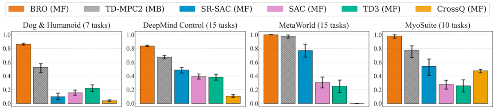

# Bigger, Regularized, Optimistic: scaling for compute and sample-efficient continuous control


- [BRO Paper](https://arxiv.org/abs/2405.16158); NeurIPS'24 **(spotlight)**
- [Project website](https://sites.google.com/view/bro-agent/)

### BRO - Short info
Sample efficiency in Reinforcement Learning (RL) has traditionally been driven by algorithmic enhancements. In this work, we demonstrate that scaling can also lead to substantial improvements. We conduct a thorough investigation into the interplay of scaling model capacity and domain-specific RL enhancements. These empirical findings inform the design choices underlying our proposed **BRO (Bigger, Regularized, Optimistic)** algorithm. The key innovation behind BRO is that strong regularization allows for effective scaling of the critic networks, which, paired with optimistic exploration, leads to superior performance. BRO achieves state-of-the-art results, significantly outperforming the leading model-based and model-free algorithms across 40 complex tasks from the DeepMind Control, MetaWorld, and MyoSuite benchmarks. BRO is the first model-free algorithm to achieve near-optimal policies in the notoriously challenging Dog and Humanoid tasks.



Our implementation of the BRO algorithm. The codebase is heavily inspired by [JaxRL](https://github.com/ikostrikov/jaxrl) and [Parallel JaxRL](https://github.com/proceduralia/high_replay_ratio_continuous_control).

## Examples
``updates_per_step``  is the most important parameter, determines how many updates are performed per environment step. It controls a trade-off between sample efficiency and computational cost. We propose ``updates_per_step=10`` as the default, as we found the higher values to bring marginal gains. 

BRO with default settings (``updates_per_step=10``):

``python3 train_parallel.py --benchmark=dmc --env_name=dog-run``

BRO (fast); in many cases, setting lower value `updates_per_step=2` bring already excellent performance, while being much faster.  

``python3 train_parallel.py --benchmark=dmc --env_name=dog-run --updates_per_step=2`` 


## Installation

To install the dependencies for the DMC experiments, run ``pip install -r requirements_dmc.txt``. Since MyoSuite requires an older version of Gym, we recommend installing it in a separate environment than DMC. 

## Other branches and related repos

1. [A torch version](https://github.com/naumix/BiggerRegularizedOtimistic_Torch) -- an educational implementation of BRO in torch.
2. [An implementation in Stable Baselines](https://github.com/naumix/sbx-tinkering/tree/add-BRO) -- version compliant with SBX.


### Citation

```
@inproceedings{
nauman2024bigger,
title={Bigger, Regularized, Optimistic: scaling for compute and sample-efficient continuous control},
author={Michal Nauman and Mateusz Ostaszewski and Krzysztof Jankowski and Piotr Miłoś and Marek Cygan},
booktitle={Advances in Neural Information Processing Systems},
year={2024},
url={https://arxiv.org/pdf/2405.16158},
}
```
